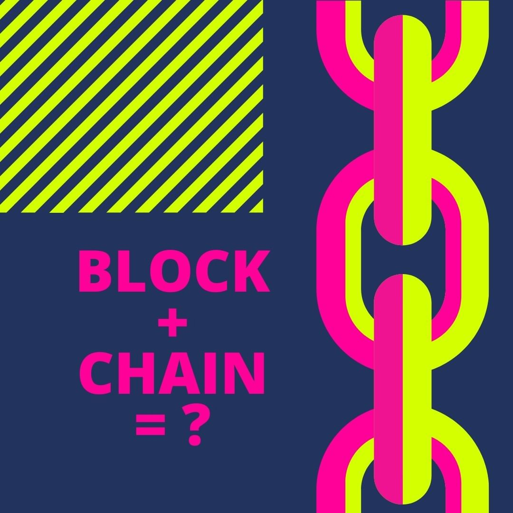
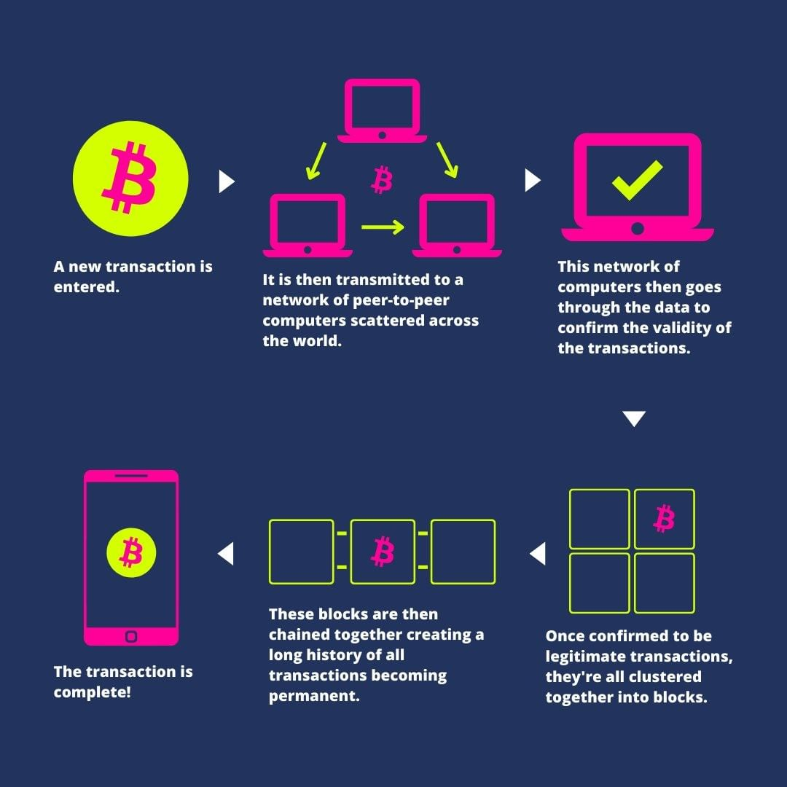

# Blockchain ? 

A blockchain is a decentralized database in which information is stored and made available on different servers (computers that provide resources). A blockchain can be understood as a kind of register, as new data is constantly being added. What is special about this system is that the records are stored as blocks that build on the previous block and contain information such as time stamps and transaction data. The block system allows all transactions to be traced, which makes data manipulation more difficult, since all blocks build on one another and the information is linked.

